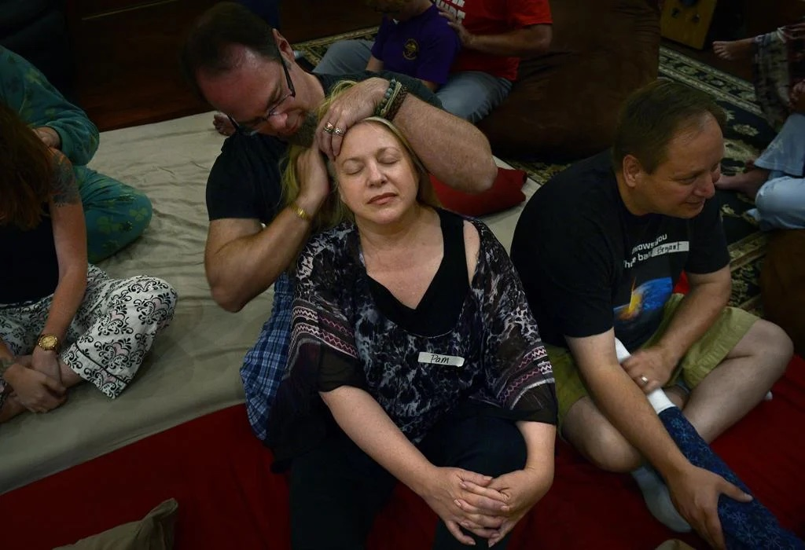

# Meet your Facilitator - Pamela Bradford

> "Cuddle parties are all about relaxing, laughing, having fun and getting to know new people. Often it's not even about the touch, it's about being in a safe place with other people and being acknowledged" - Pamela Bradford

Pamela has been facilitating cuddle parties since 2014 after a divorce. Pamela found her life consumed by work and writing, leaving months passing without the opportunity for healthy touch.

> "I would go to work in a male-dominated workplace with HR regulations — no touch," she said. "Come home and write until I went to sleep — no touch. Wake up and repeat. I hadn't touched another single human being except in the course of an accident, and you don't want to get to where you start to arrange accidents." 

Pamela completed her training and has a certified cuddle party facilitator to help herself and others in the same situation. She lost count of the number of cuddle parties she has facilitated over the last decade. 

